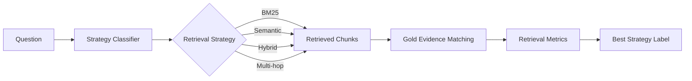

# RAG-Based Summarization for Documents
<div align="center">
  <h1>🛡️ Adaptive-RAG (Modified)</h1>
  <p><strong>Retrieval Strategy Classification Using Gold Evidence</strong></p>

  [](https://www.python.org/)
  [](LICENSE)
  []()
</div>

---

A retrieval-only reimplementation of the research question behind **Adaptive-RAG** (Jeong et al.): 
> **Given a question, which retrieval strategy — BM25, Semantic, Hybrid, or Multi-hop — is most likely to retrieve the required gold evidence?**

This project deliberately **excludes** any LLM answer-generation stage. The pipeline stops at retrieval evaluation, focusing entirely on optimizing the retrieval strategy.

### 🧠 Pipeline Overview



No answer generation, no answer EM/F1, no QA reader. See `config.yaml` section comments and each module's docstring for how this constraint is enforced structurally (e.g., `retrieval/base.py` only accepts a plain question string — gold evidence is never passed to a retriever).

---

## 📑 Table of Contents
- [Quickstart (DEBUG mode)](#-quickstart-debug-mode)
- [Running Full-Scale (FULL mode)](#-running-with-real-data-and-real-models-full-mode)
- [Configuration Checklist](#-full-scale-configuration-checklist)
- [Batched Retrieval](#%EF%B8%8F-batched-retrieval-gpu-throughput)
- [Project Layout](#-project-layout)
- [Design Notes](#-design-notes)

---

## 🚀 Quickstart (DEBUG mode)

This mode is fully offline and safe to run in a sandbox.

```bash
# Core dependencies only; see FULL mode for optional extras
pip install -r requirements.txt   

# Run the pipeline
python run_pipeline.py --config config.yaml
```

`config.yaml` ships with `run.debug: true`. In this mode:
- Every dataset loader tries the real HuggingFace `datasets` source first, and **falls back to a small offline synthetic knowledge base** if the library or network access isn't available.
- The dense/semantic retriever uses a TF-IDF stand-in encoder instead of downloading `BAAI/bge-base-en-v1.5`.
- The classifier uses TF-IDF + Logistic Regression instead of downloading `microsoft/deberta-v3-base`.

This means **the entire pipeline — all 7 stages — is verified to run end-to-end without any internet access**.

**Outputs land in `results/`:**
- 📄 `main_table.md` — comparison table
- 📄 `per_dataset_table.md` — dataset breakdown
- 📊 `classifier_test_metrics.json` + `plots/confusion_matrix.png`
- 📊 `ablations/ablations_summary.json`
- 📊 `adaptive_vs_oracle.json`

> **Note:** The synthetic offline knowledge base is tiny (~90 documents). In this toy scale, most strategies easily retrieve the right document. See clearer separation by running in FULL mode or modifying the synthetic scale.

---

## 🌍 Running with Real Data and Real Models (FULL mode)

To run with real multi-document corpora from actual datasets:

1. **Install the optional stack:**
   ```bash
   pip install sentence-transformers faiss-cpu torch transformers datasets
   ```
2. **Edit `config.yaml`:**
   ```yaml
   run:
     debug: false
   classifier:
     backend: "transformer"   # use DeBERTa-v3-base instead of TF-IDF+LogReg
   ```
3. **Re-run the pipeline:**
   ```bash
   python run_pipeline.py --config config.yaml
   ```

*(Every preprocessing loader already contains the correct real-dataset parsing logic. `run.debug=false` simply uses HuggingFace datasets natively.)*

---

## ⚙️ Full-scale Configuration Checklist

Everything needed for a real, full-scale run is config-driven. 

| Setting | Where | What to check |
|---|---|---|
| `run.debug` | `config.yaml` | Set to `false` |
| `run.device` | `config.yaml` | `"auto"` picks GPU if available; set `"cpu"`/`"cuda"` explicitly to override |
| `datasets.per_dataset_n` | `config.yaml` | Per-dataset train+val+test counts (see suggested below) |
| `classifier.backend` | `config.yaml` | `"transformer"` to use DeBERTa-v3-base instead of TF-IDF+LogReg |
| `semantic.model_name` | `config.yaml` | Real dense encoder, e.g. `BAAI/bge-base-en-v1.5` |
| `labeling.top_k` | `config.yaml` | Retrieval depth used *only* during strategy-label generation |
| `ablations.sample_size` | `config.yaml` | Caps ablation sweeps to a sample of the test split in FULL mode |
| `performance.retrieval_batch_size` | `config.yaml` | Batch size for retrieval during label generation/baselines/adaptive inference (default 32) |
| `evaluation.semantic_match_threshold` | `config.yaml` | Wired into every gold-evidence matching call |

**Suggested Datasets counts for a first full-scale run:**

| Dataset | Count (train+val+test) |
|---|---:|
| SQuAD | 4,000 |
| Natural Questions | 4,000 |
| TriviaQA | 4,000 |
| HotpotQA | 4,000 |
| 2WikiMultiHopQA | 4,000 |
| MuSiQue | 2,800 |

*(Balance is key: ensure an equal mix of single-hop and multi-hop questions so the classifier isn't biased by the largest dataset.)*

---

## ⚡️ Batched Retrieval (GPU Throughput)

Every retriever exposes `retrieve_batch(queries: list[str], top_k: int) -> list[list[dict]]`. 

- **Semantic**: Encodes the batch in one forward pass, then does one batched FAISS/numpy search.
- **Hybrid**: Batches semantic logic; BM25 remains CPU-bound per-query.
- **Multi-hop**: Hop-synchronized batching — active questions are batched through the hybrid retriever per hop, avoiding redundant encoder costs.

All major entrypoints (`generate_labels.py`, `run_retrieval_baselines.py`, `run_adaptive.py`) automatically batch retrieval based on `performance.retrieval_batch_size`. This changes throughput, *not* results.

---

## 📁 Project Layout

```text
adaptive_rag_modified/
├── config.yaml                  # Every knob in one place
├── requirements.txt
├── run_pipeline.py              # Runs all 7 stages end-to-end
├── utils.py                     # Shared IO / text-normalization / seeding
│
├── preprocessing/               # Dataset loaders -> unified schema
├── corpus/                      # Document chunking & indexing (BM25 + Dense)
├── retrieval/                   # Strategies (BM25, Semantic, Hybrid, Multi-hop)
├── labeling/                    # Automatic strategy-label generation
├── classifier/                  # 4-class question -> strategy classifier
├── evaluation/                  # Evidence matching, metrics, oracle bounds
└── experiments/                 # Reproducible scripts (baselines, ablations, etc.)
```

---

## 🔍 Design Notes

- **No LLM Generation:** There is no answer generation step. "Answer" is only used as a dataset field, never as a generation target.
- **No Evidence Leakage:** Retrievers are purely given `(query, top_k)`. Multi-hop refines queries using retrieved chunk text, not gold evidence.
- **Strict Classifier Inputs:** Only the question text is fed to the classifier.
- **Matching Fallbacks:** ID-based matching is preferred, falling back to exact text -> Token F1 -> Semantic Cosine.
- **Efficient Caching:** Indices, embeddings, and retrieval results are aggressively cached based on the chunk corpus and config.
- **Reproduibility:** Experiments log config-derived cache keys natively. Wrap `run_pipeline.py` with system reports (e.g. `nvidia-smi`) for total environment logging.
